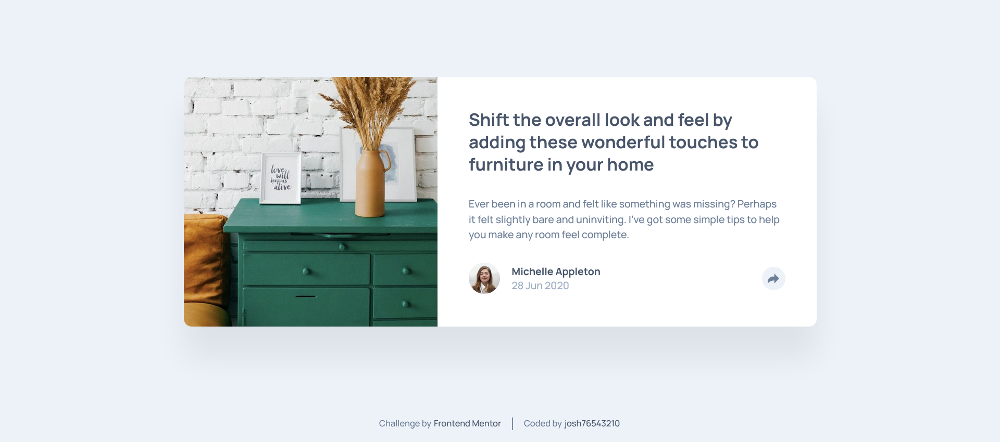

# Frontend Mentor - Article preview component solution

This is a solution to the [Article preview component challenge on Frontend Mentor](https://www.frontendmentor.io/challenges/article-preview-component-dYBN_pYFT). Frontend Mentor challenges help you improve your coding skills by building realistic projects.

## Table of contents

- [Overview](#overview)
  - [The challenge](#the-challenge)
  - [Screenshot](#screenshot)
  - [Links](#links)
- [My process](#my-process)
  - [Built with](#built-with)
  - [What I learned](#what-i-learned)
- [Author](#author)

## Overview

### The challenge

Users should be able to:

- View the optimal layout for the component depending on their device's screen size
- See the social media share links when they click the share icon

### Screenshot



### Links

- Solution URL: [Add solution URL here]()
- Live Site URL: [Add live site URL here]()

## My process

### Built with

- HTML
- CSS
- JS

### What I learned

Creating the share popup using css

```css
.share-box {
  cursor: default;
  position: absolute;
  bottom: 10.6rem;
  right: -7rem;
  background-color: var(--very-dark-grayish-blue);
  box-shadow: 0 1rem 1rem #00000022;
  border-radius: 1rem;
  height: 6rem;
  width: 25rem;
  z-index: 999;

  display: flex;
  align-items: center;
  justify-content: center;
  gap: 2rem;
}

.share-box-arrow {
  cursor: default;
  position: absolute;
  bottom: 9.7rem;
  right: 4.5rem;
  transform: rotate(225deg);
  background: transparent;
  box-shadow: -1rem -1rem 1rem #00000011;
  height: 2rem;
  width: 2rem;
  overflow: hidden;
  z-index: 999;
}

.share-box-arrow::after {
  content: "";
  background: var(--very-dark-grayish-blue);
  width: 142%;
  height: 142%;
  position: absolute;
  transform: rotate(45deg) translate(-71%, 0);
}
```

## Author

- Frontend Mentor - [@josh76543210](https://www.frontendmentor.io/profile/josh76543210)
- Twitter - [@josh76543210](https://www.twitter.com/josh76543210)
